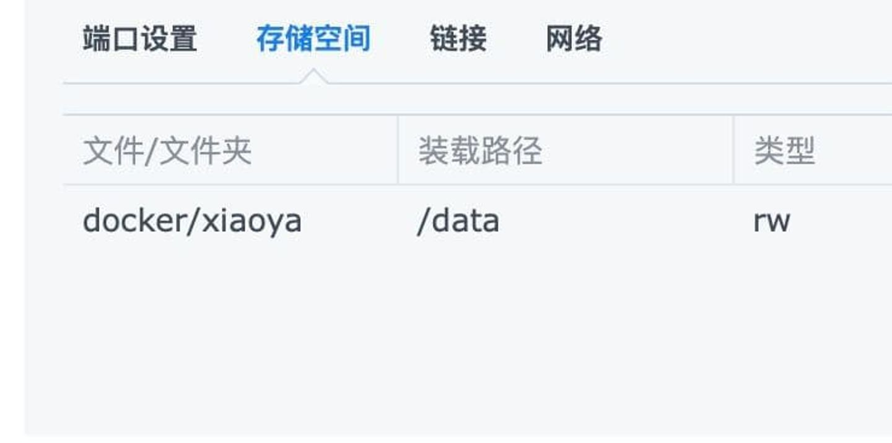
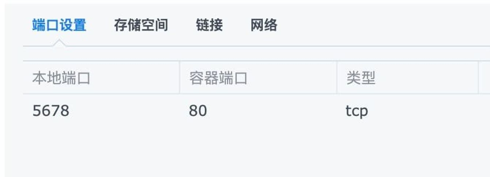

<iframe id="intercom-frame" aria-hidden="true" tabindex="-1" title="Intercom" style="outline: 0px; box-sizing: border-box; color: rgb(0, 0, 0); font-family: sans-serif; font-size: medium; font-style: normal; font-variant-ligatures: normal; font-variant-caps: normal; font-weight: 400; letter-spacing: normal; orphans: 2; text-align: start; text-indent: 0px; text-transform: none; widows: 2; word-spacing: 0px; -webkit-text-stroke-width: 0px; white-space: normal; text-decoration-thickness: initial; text-decoration-style: initial; text-decoration-color: initial; pointer-events: none; position: absolute !important; opacity: 0 !important; width: 1px !important; height: 1px !important; top: 0px !important; left: 0px !important; border: none !important; display: block !important; z-index: -1 !important;"></iframe>

如何设置xiaoya的docker

Built with

Drag image to reposition

# 如何设置xiaoya的docker

要获得最新小雅的资讯请关注小雅的tg频道 https://t.me/xiaoyaliu

平时有什么使用上遇到的困难可以来这里找我或其他人帮助 https://t.me/PlutoPlayer

目录

[你需要什么才能安装 xiaoya 的docker](https://xiaoyaliu.notion.site/xiaoya-docker-69404af849504fa5bcf9f2dd5ecaa75f?pvs=25#444f2033d834427b80114fc0d774d53c)

[如何安装](https://xiaoyaliu.notion.site/xiaoya-docker-69404af849504fa5bcf9f2dd5ecaa75f?pvs=25#b9b9c512cf7b466ea5eb01a11b18353a)

[openwrt或者vps下安装，调出终端命令行](https://xiaoyaliu.notion.site/xiaoya-docker-69404af849504fa5bcf9f2dd5ecaa75f?pvs=25#8c8e44b3fa734ea5b5ca86bb604d3667)

[NAS 下图形配置安装](https://xiaoyaliu.notion.site/xiaoya-docker-69404af849504fa5bcf9f2dd5ecaa75f?pvs=25#2e7b253b497f4a97ba20a8e8aac17b96)

[额外功能](https://xiaoyaliu.notion.site/xiaoya-docker-69404af849504fa5bcf9f2dd5ecaa75f?pvs=25#2ef5119ad3cc41a8a3f9674e497736a7)

[设置强制登入，和自定义密码](https://xiaoyaliu.notion.site/xiaoya-docker-69404af849504fa5bcf9f2dd5ecaa75f?pvs=25#8647f4096f494a9c89a9bb5295c37a18)

[容器内 /data 目录的文件功能说明：](https://xiaoyaliu.notion.site/xiaoya-docker-69404af849504fa5bcf9f2dd5ecaa75f?pvs=25#bc572531d09e4baa80afdf3f52653c7d)

[配置好了docker，但是浏览器访问不了怎么办](https://xiaoyaliu.notion.site/xiaoya-docker-69404af849504fa5bcf9f2dd5ecaa75f?pvs=25#ee6824be316749c29645a2e9cb40a1e0)

[无法打开页面](https://xiaoyaliu.notion.site/xiaoya-docker-69404af849504fa5bcf9f2dd5ecaa75f?pvs=25#88ef3c7874444604a11e8812e5ba3de4)

[启动加载慢](https://xiaoyaliu.notion.site/xiaoya-docker-69404af849504fa5bcf9f2dd5ecaa75f?pvs=25#748306dcb4584d2c935e6d24fa64464d)

[出现 “The input paramter refresh_token is not valid”](https://xiaoyaliu.notion.site/xiaoya-docker-69404af849504fa5bcf9f2dd5ecaa75f?pvs=25#172647764c93426ab38ac26888367b9f)

[如何修复](https://xiaoyaliu.notion.site/xiaoya-docker-69404af849504fa5bcf9f2dd5ecaa75f?pvs=25#1c50d39fabf246bc8f813998a21a83b0)

[阿里的风控](https://xiaoyaliu.notion.site/xiaoya-docker-69404af849504fa5bcf9f2dd5ecaa75f?pvs=25#6b42128605b841288455a52b8a06bc9f)

[什么软件可以连接 xiaoya ？](https://xiaoyaliu.notion.site/xiaoya-docker-69404af849504fa5bcf9f2dd5ecaa75f?pvs=25#3806600cf7d342328be47e961f301f83)

[文件管理类型：](https://xiaoyaliu.notion.site/xiaoya-docker-69404af849504fa5bcf9f2dd5ecaa75f?pvs=25#f3d42f08ce654f49adc7716bedfc711f)

[视频播放器：](https://xiaoyaliu.notion.site/xiaoya-docker-69404af849504fa5bcf9f2dd5ecaa75f?pvs=25#9841cc713fd04cf4a99fbc0de977c094)

[挂载到本地目录：](https://xiaoyaliu.notion.site/xiaoya-docker-69404af849504fa5bcf9f2dd5ecaa75f?pvs=25#c5181eb5efd0469db83ec7daaef2edc3)

[如何在播放器上通过webdav 连接 xiaoya的 docker](https://xiaoyaliu.notion.site/xiaoya-docker-69404af849504fa5bcf9f2dd5ecaa75f?pvs=25#4e2e47e1bbfa456b841498857371c91d)

[potplayer](https://xiaoyaliu.notion.site/xiaoya-docker-69404af849504fa5bcf9f2dd5ecaa75f?pvs=25#70e72fdb5aae433fabbb4c6dbb94198e)

[nplayer](https://xiaoyaliu.notion.site/xiaoya-docker-69404af849504fa5bcf9f2dd5ecaa75f?pvs=25#5d6865c255404e49be88f8254efed0f8)

[Kodi](https://xiaoyaliu.notion.site/xiaoya-docker-69404af849504fa5bcf9f2dd5ecaa75f?pvs=25#deaac7cf96ca4a1ebf1cffd8dd1271c6)

[Nova 魔改版（支持webdav，https://t.me/PlutoPlayer/127849 ）](https://xiaoyaliu.notion.site/xiaoya-docker-69404af849504fa5bcf9f2dd5ecaa75f?pvs=25#b2ae6dd2ab7344ae92055b41bc097170)

[infuse](https://xiaoyaliu.notion.site/xiaoya-docker-69404af849504fa5bcf9f2dd5ecaa75f?pvs=25#ef009d64da674325af7e1e02489c380f)

[TVBOX](https://xiaoyaliu.notion.site/xiaoya-docker-69404af849504fa5bcf9f2dd5ecaa75f?pvs=25#11fe173d670a4cf59142de0a83c8056f)

[如何配置自己的token](https://xiaoyaliu.notion.site/xiaoya-docker-69404af849504fa5bcf9f2dd5ecaa75f?pvs=25#a635d79db05f4720823d6991aa4e905d)

[阿里token](https://xiaoyaliu.notion.site/xiaoya-docker-69404af849504fa5bcf9f2dd5ecaa75f?pvs=25#1d0efe7db420490894c025525954090b)

[Pikpak 账号](https://xiaoyaliu.notion.site/xiaoya-docker-69404af849504fa5bcf9f2dd5ecaa75f?pvs=25#3da91e8878c940e2a877dd8571d8f2e0)

[如何确认自己的pikpak账号设置了没有？](https://xiaoyaliu.notion.site/xiaoya-docker-69404af849504fa5bcf9f2dd5ecaa75f?pvs=25#77e27e4c250e41b7ad1f1b23b759fb29)

[我的账号填对了，为什么还看不到pikpak目录下的内容？](https://xiaoyaliu.notion.site/xiaoya-docker-69404af849504fa5bcf9f2dd5ecaa75f?pvs=25#7285b91c8f2b47f8b98ac00b02000f3e)

[如何测试我的alist能够联通pikpak服务器？](https://xiaoyaliu.notion.site/xiaoya-docker-69404af849504fa5bcf9f2dd5ecaa75f?pvs=25#48d58ffce04b4e9b8a62ab99d017d852)

[播放不了视频怎么办，视频有画面没声音怎么办？](https://xiaoyaliu.notion.site/xiaoya-docker-69404af849504fa5bcf9f2dd5ecaa75f?pvs=25#2d09893406cb493d85bf348666c95052)

[出现了“磁盘满了，故障排查”怎么办](https://xiaoyaliu.notion.site/xiaoya-docker-69404af849504fa5bcf9f2dd5ecaa75f?pvs=25#f825d9134b0743b7abcf1f8ae71b3454)

[Alist V3 无法套娃挂载 xiaoya 怎么办？](https://xiaoyaliu.notion.site/xiaoya-docker-69404af849504fa5bcf9f2dd5ecaa75f?pvs=25#f09623a7c57d485b9eb8a2e9be75628e)

[如果我布署在vps上会不会消耗我的流量？](https://xiaoyaliu.notion.site/xiaoya-docker-69404af849504fa5bcf9f2dd5ecaa75f?pvs=25#e67dbde858ff4942a6fe18c9fcc2aea3)

[如何定时和网站同步数据](https://xiaoyaliu.notion.site/xiaoya-docker-69404af849504fa5bcf9f2dd5ecaa75f?pvs=25#85a303266fcf499896d2cfda4e3b855a)

[我的一些邀请码和推荐和小插件](https://xiaoyaliu.notion.site/xiaoya-docker-69404af849504fa5bcf9f2dd5ecaa75f?pvs=25#f374eed0c31840969135d09696aaeb98)

[阿里注册](https://xiaoyaliu.notion.site/xiaoya-docker-69404af849504fa5bcf9f2dd5ecaa75f?pvs=25#fc909a49020d4f2298b30087c42a36d5)

[pikpak注册](https://xiaoyaliu.notion.site/xiaoya-docker-69404af849504fa5bcf9f2dd5ecaa75f?pvs=25#ccd1c64298c74dccb1e6f66a3dfb577d)

[机场推荐](https://xiaoyaliu.notion.site/xiaoya-docker-69404af849504fa5bcf9f2dd5ecaa75f?pvs=25#d8c6d652116b4b95a40245faa1780c73)

[检查token的有效性 （32位）](https://xiaoyaliu.notion.site/xiaoya-docker-69404af849504fa5bcf9f2dd5ecaa75f?pvs=25#8e226c10e0b049a8ad3ff28a4e90a5a5)

[检查open token的有效性 （280位）](https://xiaoyaliu.notion.site/xiaoya-docker-69404af849504fa5bcf9f2dd5ecaa75f?pvs=25#39d3a42964884856a48773936ebd312a)

[手动签到阿里云盘](https://xiaoyaliu.notion.site/xiaoya-docker-69404af849504fa5bcf9f2dd5ecaa75f?pvs=25#ec40ba3edb56421a8459fd994c92347f)

[油猴豆瓣插件（包含小雅搜索）](https://xiaoyaliu.notion.site/xiaoya-docker-69404af849504fa5bcf9f2dd5ecaa75f?pvs=25#f7ed1cbd75f74e2c9462fff6737e1b4c)

[如果你觉得小雅帮助了你，请给小雅打赏，不要吝啬哦](https://xiaoyaliu.notion.site/xiaoya-docker-69404af849504fa5bcf9f2dd5ecaa75f?pvs=25#485235da8be14e46a7bb4852fc437ccd)

## 你需要什么才能安装 xiaoya 的docker

软路由盒子类似 n1 等，具有 openwrt环境 （可以终端上一键配置）

NAS 等具有docker插件 （无法或很难登入终端，需要图形化自行配置）

1

云服务器也就是俗称的 vps （可以终端上一键配置）

2

## 如何安装

### openwrt或者vps下安装，调出终端命令行

1

openwrt控制面板左侧（“系统”或“服务”下找到“TTY终端”）

3

ssh 登入 openwrt

1

然后一键安装

1

> bash -c "$(curl http://docker.xiaoya.pro/update_new.sh)"
>
> 
>
> 9+

如果是用host模式安装，则用

> bash -c "$(curl http://docker.xiaoya.pro/update_new.sh)" -s host
>
> 
>
> 3

第一次安装会出现下面的显示

你需要配置好三个必要参数再安装：

|                     | 对应文件                                | 获取方式                                                     |
| ------------------- | --------------------------------------- | ------------------------------------------------------------ |
| token               | /etc/xiaoya/mytoken.txt                 | https://aliyuntoken.vercel.app/ [ https://alist.nn.ci/zh/guide/drivers/aliyundrive.htm](https://alist.nn.ci/zh/guide/drivers/aliyundrive.htm)l |
| open token          | /etc/xiaoya/myopentoken.txt             | https://alist.nn.ci/zh/guide/drivers/aliyundrive_open.html   |
| 转存目录的folder id | /etc/xiaoya/temp_transfer_folder_id.txt | 先转存这个 https://www.aliyundrive.com/s/rP9gP3h9asE  到自己网盘（选择资源盘），然后浏览器打开转存后的目录，浏览器的url  https://www.aliyundrive.com/drive/file/resource/640xxxxxxxxxxxxxxxxxxxca8a 最后一串就是，记得这个目录不要删，里面的内容可以定期删除 |

1

参考视频

This video format (mp4) can't be played on this device.

[Learn more](https://www.notion.so/help/images-files-and-media)

配置的内容和格式参考 “容器内 /data 目录的文件功能说明” 章节，有些平台需要额外在服务器的防火墙上开放端口，选择放行 5678或者6789端口

### NAS 下图形配置安装

请参照下面的 群晖配置截图，其它NAS产品的配置大同小异

3

详见 [http://alist.xiaoya.pro/安装，配置，修复%20xiaoya%20docker%20指南/群晖NAS%20Docker安装xiaoya.pdf](http://alist.xiaoya.pro/)

9+

有的群晖因为固件原因，装载路径是 /data 保存应用会失败，那么尝试这样

这是unraid的配置参考

.png)

记住 端口映射是 5678 → 80 不是 5244  不然搜索会失效，出现下面的错误

2

.png)

.png)

### 额外功能

1

自动签到

3

检查token有效性工具

配合TVBOX 的json文件，可以搜索xiaoya的docker内容

挂载自定义的pikpak分享

挂载自己的多个pikpak网盘

挂载自定义的阿里分享资源

## 设置强制登入，和自定义密码

2

把密码保存到 /etc/xiaoya/guestpass.txt （不过不要设置稀奇古怪的符号，例如；&#“~@（）*$  之类的）

2

如果你的xiaoya放在公网，为了防止别人蹭网，可以设置强制登入，新增 /etc/xiaoya/guestlogin.txt 这个文件，重启即可，文件有没有内容无所谓，如果取消强制登入就删除这个文件。强制登入的账号为 dav，密码使用 /etc/xiaoya/guestpass.txt 里设置的，同时webdav连接使用 dav 这个用户

3

上述2个功能设置好后需要重启docker才会生效。

## 容器内 /data 目录的文件功能说明：

2

标注*** 的文件为必要，必须存在和有内容，所有的配置文件缺省位置在宿主机的 /etc/xiaoya

文件：mytoken.txt *** 用途：用来加载阿里分享，和自动签到 格式：75fee1ca79514e60aa6d46c8370b9afd 备注：32位长度，参考 https://t.me/PlutoPlayer/239324

文件：myopentoken.txt *** 用途：用来加载自己的阿里云盘（open接口） 格式：eyJ0eXAiOixxxxxLCJhbGciOiJSUzI1NiJ9.eyJzd999999wNzBkOWRiNWQ5YmQ0YT........ 备注：很长一串，280位，获取方式 https://alist.nn.ci/zh/guide/drivers/aliyundrive_open.html

1

文件：temp_transfer_folder_id.txt *** 用途：你的阿里网盘的转存目录的folder id 格式：640xxxxxxxxxxxxxxxxxxxca8a 备注：打开你阿里云盘网页，目录所在的浏览器地址 https://www.aliyundrive.com/drive/folder/640xxxxxxxxxxxxxxxxxxxca8a   最后一串就是

.png)

如果你升级到了阿里云盘app 4.9或以上，那么整个账号的设置会有大改动，你需要在新的“资源库”创建一个目录，先转存这个

https://www.aliyundrive.com/s/rP9gP3h9asE

然后打开浏览器，打开转存后的目录，在浏览器的url里获取folder id

.png)

文件：pikpak.txt 用途：用来观看pikpak分享 格式："xxxxxxxx" "yyyyyyyy" 备注：账号可以是邮箱和手机号，手机号前面要加区号，也就是 "+86xxxx" 这样，注册如果用谷歌快捷方式登入的话是无法使用谷歌邮箱登入的（alist不支持）

.png)

文件：guestpass.txt 用途：自己修改 guest 账号的密码 备注：如果开启了强制登入则 登入账号 dav 也使用此密码

文件：guestlogin.txt 用途：通过此文件的存在与否来决定是否开启强制登入 格式：空白文件，不需要强制登入功能，则删除此文件

文件：show_my_ali.txt 用途：通过此文件的存在与否来决定是否加载自己的阿里云盘 格式：空白文件，不需要加载的，则删除此文件

1

文件：docker_address.txt 用途：配合 TVBOX的alist搜索 格式：http://xxxxx:5678   （最后不要加 /)

1

.png)

TVBOX 配置地址 http://xxxxx:5678/tvbox/my.json TVBOX 配置地址（多仓，需要TVBox壳支持） http://xxxxx:5678/tvbox/juhe.json

.png)

.png)

.png)

.png)

.png)

.png)

文件：docker_address_ext.txt 用途：外网地址，配合tvbox外网访问，对应的配置地址是 http://xxxx/tvbox/my_ext.json 格式：http://xxxxx:5678   （最后不要加 /)

文件：iptv.m3u 用途：在my.json中自定义额外的直播源 "我的私用” 格式：标准的m3u格式

1

.png)

.png)

文件：tv.txt 用途：挂载自定义直播源到xiaoya 格式：tvbox的直播源格式，如图所示

备注：直播源有格式，区域限制等问题，有的可以在网页观看，有的需要用播放器才能看

.png)

.png)

文件：proxy.txt 用途：使用代理，http，https，socks5 协议 格式：http://xxxxx:7890  或 socks5://xxxxx:7891 （最后不要加 /)

1

文件：alist_token_expire_time.txt 用途：设置alist auth token的有效期，缺省4800（对于无所谓安全的用户来说方便） 格式：72 （数字，单位是小时)

文件：alist_auth_token.txt 用途：无需设置，自动生成，可以用来配置alist v3方式套娃，删除后会重新生成一个新的 格式：alist-09ceb38a-f143-47f7-b255-c3eec819cd7bxxxxxxxxxxxxx

文件：tvbox_security.txt 用途：开启tvbox的随机订阅地址，防止公网上被人蹭，让别人猜不到你的订阅地址 格式：空白文件，没有则不开启

文件：tvbox_config.txt 用途：无需设置，自动生成， 格式：http://xxxxx:5678/tvbox/sdfh02ye.my.txt

文件：tvbox_config_ext.txt 用途：无需设置，自动生成，外网的随机订阅地址， 格式：http://xxxxx:5678/tvbox/sdfh02ye.my_ext.txt

文件：my.json 用途： 自定义tvbox配置文件 格式： TVBOX 兼容的json配置文件格式

文件：pikpak_list.txt 用途：挂载自己一个或多个 pikpak账号 格式：挂载名  "账号" "密码"  ，用空格分开（pikpak2  “abc@hotmail.com" "123456"），每行一个

备注：挂载名不能有空格

文件：alist_list.txt 用途：挂载一个或多个 Alist 套娃 格式：挂载名  alist版本（v2或v3）网址 目录，用空格分开每行一个 备注：挂载名不能有空格，网址最后不要有斜杠

1

.png)

文件：pikpakshare_list.txt 用途：挂载自己一个或多个 pikpak分享 格式：挂载名  分享ID 分享目录  ，用空格分开（赵霸道  VNRT8Wr8BGyw1kt1HkijKR4Qo1  VNQf6ZmWE3pVWGpuFriGqyPzo1），每行一个 备注：挂载名不能有空格

1

.png)

文件：alishare_list.txt 用途：挂载自定义分享ID 格式：挂载名 阿里分享ID 文件folder id，用空格分开，每行一个 120T电影资源     ZpevUcDZ2Pn  636c8ba0703acd24cd44b19dd00312ef15b1e8 60T各种资料       s6NBDauc5VZ  63b16e82a50ca34f6c7466293235a06d1af8ea3

1

备注：挂载名不能有空格

.png)

另外提醒一下，不同平台导致的文本文件格式有差别，确保是 unix格式，utf-8编码，不然会出现乱码，网页报错，无法进入目录等奇奇怪怪的问题，看截图，确保编码格式正确

.png)

1

示范配置文件 

配置文件范例.zip

2.1KB

## 配置好了docker，但是浏览器访问不了怎么办

5

#### 无法打开页面

.png)

2

.png)

最简单就是用host模式（端口6789）安装一次，可以规避桥接模式遇到防火墙规则冲突等问题

2

JSON

Copy

bash -c "$(curl -s http://docker.xiaoya.pro/update_new.sh)" -s host

#### 启动加载慢

.png)

2

请先检查alist所在设备的网络连接情况，

正常的加载时间是在1分钟-5分钟内，如果超过5分钟，那么可能有问题了，检查日志

docker logs -f xiaoya

如果看到

.png)

那么就是触发了alist的open接口的限制

.png)

那你需要暂停一小时，停止所有alist相关的镜像

JSON

Copy

docker stop xiaoya docker stop xiaoya-hostmode  （如果是host模式安装的镜像） docker stop alist

一小时后再开启这些镜像

JSON

Copy

docker start xiaoya docker start alist

或者可以通过科学 上网切换节点的方式变更IP来规避这个限制（因为它是以IP计算的）

#### 出现 “The input paramter refresh_token is not valid”

.png)

替换token， mytoken.txt 那个32位长的token

#### 如何修复

curl http://docker.xiaoya.pro/version.txt 看看有没有获取到版本号

.png)

如果没有获取到版本号，那么就是网络问题，先解决网络联通的问题。

如果上面检测能获取版本号，说明网络没问题，那么就大概率是防火墙的问题，有可能是其它软件干扰了docker的防火墙规则，可以这样尝试修复docker防火墙规则

JSON

Copy

service dockerd restart

或者 （视乎你的系统）

JSON

Copy

systemctl restart docker

目的是重启 Docker Daemon管理进程来重建docker 防火墙规则，然后再

> docker restart xiaoya
>
> 
>
> 6

如果还是不行，那要使出终极大招了

JSON

Copy

iptables -F service dockerd restart docker restart xiaoya

依次执行

## 阿里的风控

阿里更新了接口，有好几个人都出现一会儿能放一会儿不能放的情况，共同点就是都是使用infuse，然后在刮削扫描，那么综合起来，可以判断出阿里对短时间同IP大量请求会出现限制，

表现在网页就是出现 ParamFlowException

表现在播放器就是500错误

大家留意一下，尽量停掉扫描，过一会而会自动好

.png)

.png)

所以现在不要刮削，阿里开始动态连接管理了，短时间大量请求直接抛出错误，长时间不确定会怎么处理，肯定对token和账号会做出限制，因为从被连接放来说，看起来就像流量攻击，我之前防止别人对我的网站建索引也是采用差不多的手段

现在下面这些行为就变成了高危操作

使用infuse等缺省设置进行扫描获取元数据

使用kodi，plex，jellyfin，emby进行刮削

使用alist进行建索引

一定要小心不要让短期限制变成对你账户的长期限制，停止上述3种行为

## 什么软件可以连接 xiaoya ？

#### 文件管理类型： 

ES文件浏览器，Solid Explorer

#### 视频播放器：

IOS 平台： infuse， fileball，nplayer

2

安卓平台： nplayer， Kodi， Reex， NovaPlayer（魔改版）

2

windows： potplayer

#### 挂载到本地目录：

rclone，davfs2，raidrive，Mountain Duck

## 如何在播放器上通过webdav 连接 xiaoya的 docker

参考 potplayer, nplayer, kodi 的配置截图

webdav 账号密码

用户: guest 

密码: guest_Api789

3

#### potplayer

.png)

2

#### nplayer

.png)

#### Kodi

.png)

.png)

#### Nova 魔改版（支持webdav，https://t.me/PlutoPlayer/127849 ）

.png)

#### infuse

3

.png)

#### TVBOX

把你的docker url 填写进 docker_address.txt （缺省在 /etc/xiaoya 目录下）

比如 http://192.168.2.1:5678

在TVBOX 的配置地址填入 http://192.168.2.1:5678/tvbox/my.json

.png)

1

可以支持xiaoya的搜索

.png)

也可以用浏览的方式

.png)

如何想自定义配置的json文件，则放置在 /etc/xiaoya/my.json 即可

1

## 如何配置自己的token

#### 阿里token

1

 https://alist.nn.ci/zh/guide/drivers/aliyundrive.html    或

https://aliyundriver-refresh-token.vercel.app/

3

获取你的移动端token

然后，在终端命令行 （xxxxxxxxxxxxxxxx 就是你获取的token）

echo xxxxxxxxxxxxxxxxxxxxxx > /etc/xiaoya/mytoken.txt

6

或者将你自己获取到的token粘贴至 etc/xiaoya/mytoken.txt文件里并保存。

4

NAS或者其它自行配置的请放入自己在配置中设定的文件夹中，文件名是 mytoken.txt

记住一定要是移动端获取的，并且是32位长度

是否正确放置了进去，可以通过下面指令来确认

docker exec -it xiaoya cat /data/mytoken.txt

4

#### Pikpak 账号

把你的pikpak账号 保存到 /etc/xiaoya/pikpak.txt

1

格式如下：

Add an image

1

"xxx" "yyy" （将xxx替换为账号，yyy替换为为密码，"账号" "密码"中间有空格，切记引号要英文字符的，是 " 不是 “）

如果账号是手机号，要 +区号 ，比如你的手机号 12345678900 ，那么就填 “+8612345678900”

通过第三方认证注册的（比如谷歌），请留意看 *“我的账号填对了，为什么还看不到pikpak目录下的内容”* 的内容

[注册开通PikPak请点击 ](https://toapp.mypikpak.com/activity/invited?code=73900974)[注册](https://toapp.mypikpak.com/activity/invited?code=73900974)

注册2个账号，一个用来存，一个用来看

注册后在 如图所示位置输入”兑换码“ 73900974 既可获得5天的试用会员资格，然后你利用5天时间去把空间塞满，5天会员到期后内容不会被删除，只能看不能存，这个账号也会被限速，你就把它当作分享盘（分享给自己的另一个账号或别人）

注册另一个账号，不要存超过6G的东西，只要不超过基本会员的免费6G空间，就可以不限速，这个用来看别人的分享或者自己的另一个账号的分享

.png)

.png)

注册尽量利用邮箱注册，这个就可以注册很多个

如果出现下面几个这样的图示，则表示你需要科学上网，有的地区可以直连，有的地区不行

3

.png)

.png)

#### 如何确认自己的pikpak账号设置了没有？

通过下面指令来确定

docker exec -it xiaoya cat /data/pikpak.txt

#### 我的账号填对了，为什么还看不到pikpak目录下的内容？

如果不是账号密码填错，那么我猜你是这样的情况，注册的时候使用了google，FB等第三方快捷注册，虽然看起来账号是谷歌邮箱，但实际上是不能用邮箱登入，而必须使用第三方验证，alist现在还不支持这种跳转到第三方的验证，所以你要么在账号设置里绑定一个邮箱，或者重新注册一个新账号

你可以自己验证一下，选择邮箱登入，输入你的gmail邮箱看行不行

.png)

#### 如何测试我的alist能够联通pikpak服务器？

在alist所在的设备命令行输入

curl https://inapp.mypikpak.com/ping

如果出现一大堆内容，则表示能联通pikpak，反之则否

## 播放不了视频怎么办，视频有画面没声音怎么办？

如果是用浏览器有的能放，有的不能放，那么大概率是浏览器视频解码能力不足，请调用第三方播放器尝试，或者通过webdav连接alist来播放（一般浏览器不支持 H.265 和  AC3 编码视频）

.png)

## 出现了“磁盘满了，故障排查”怎么办

.png)

有这几种可能：

你的网盘满了

token 或者 opentoken失效

无法刷新opentoken（60分钟10次的限制）

token和opentoken不是一个账号的

你删除了转存目录（即使你再重新创建一个同名的也没用，folder id变了）

## Alist V3 无法套娃挂载 xiaoya 怎么办？

.png)

执行下面代码获取令牌

JSON

Copy

docker exec -i xiaoya sqlite3 data/data.db <<EOF select value from x_setting_items where key = "token"; EOF

2

把令牌填到 Authorization， Server 选用本地的docker 地址，不要填账号和密码

## 如果我布署在vps上会不会消耗我的流量？

302重定向和本地代理的差别是什么？

假设：

A 是播放器 

B 是alist 

C 是阿里

302：       A访问B，B告诉A，你要的东西在C那里，我给你个地址，你直接找C，然后A直连C

1

​       因为 A 最好播放的时候直接连 C了，所以不消耗 B的流量，也就是B所在的vps流量

1

本地代理：       A访问B，B去访问C，把内容取回来，直接返回A，B做了中间人做转发

​       B 在C的播放过程中消耗了 从C取内容（拉）+ 传给A （推），一进一出的流量

2

我以这个资源为例做具体说明

.png)

复制连接得到的是

http://alist.xiaoya.pro/d/音乐/流行/自听无损音乐545首%20全部有封面歌词/王忻辰、苏星婕%20-%20清空.flac

连接这个url得到第一个跳转

.png)

https://pdsapi.aliyundrive.com/v2/redirect?id=73e8b1fe5c204f1a85ea1ba3789e2da11673682931272933093

[73e8b1fe5c204f1a85ea1ba3789e2da11673682931272933093](https://pdsapi.aliyundrive.com/v2/redirect?id=73e8b1fe5c204f1a85ea1ba3789e2da11673682931272933093) 就是这个资源（flac 文件）在阿里云盘系统里面的编号

继续顺着跳转的url 连接会得到最终的阿里云的临时CDN资源的实际位置

.png)

这个一长串的才是真正的资源存放地址，播放器就是通过这个最终的url，打开资源播放，这个资源是有有效期的，就是这个标志，是个unix的时间戳，你转换一下就知道是6个小时

.png)

也就是六小时后你再用同样的url是打不开这个连接的，因为失效了，为什么要搞那么复杂，阿里直接给个资源存放地址不就完了，这是因为为了给用户最好的体验，更快的打开，使用了前置的缓存，也就是CDN，不同的用户获取到的CDN资源地址是有可能不一样的，阿里的CDN遍布全国，北京有，广东也有，北京的用户去广东取就会慢，才去就近最快速度的原则，北京附近的就指向北京的CDN资源，广东附近的就指向广东的CDN资源，但是CDN是中间层做缓存用的，就好像你硬盘的一级缓存，不是资源的最终存放地，量有限而且贵（使用内存加高速硬盘肯定贵），所以需要把不用的资源删除腾出地方给有用的，所以就有了有效期这个限制，过了有效期就删除腾地。

另外，要说明的是alist的代理角色，它是流量代理，不是缓存代理，所以并不能提高真实的视频播放流畅度，我以水管作为例子，

流量代理：

在网络通畅的情况下A → C 直管连接是最快的，B就好比水管的弯头/三通，A和C之间有一堵墙没法直连，那只能A → B, 然后 B → C , 这样通了多少是有损毁的，流速（用网络的名词就是多了延迟），实际体验就是不能看的变成能看了

缓存代理：

在A 和 C通和不通的情况下都可以实现，这是B的角色更像是增压阀，A → B 的管子应该比 B→ C 的管子粗，通过增压阀来保证B→ C 的（水压）流速，缓存代理是包含了上面流量代理的功能，实际体验就是不但能看而且看起来不卡了

1

## 如何定时和网站同步数据

如果你是基于Linux系统的（包括openwrt），可以用以下方法设置定时更新，终端执行

crontab -e

6

添加一条记录

0 6 * * * docker restart xiaoya

4

按 o 插入一行

然后把这堆文字输入进去

然后按键盘左上角 ESC键退出编辑模式

输入 :wq 保存退出

就是每天凌晨6点自动重启xiaoya docker去同步数据，你把6改成13，那就是下午1点，至于编辑器vi的使用方法请自行百度。

1

1

## 我的一些邀请码和推荐和小插件

#### 阿里注册

https://www.aliyundrive.com/s/RAofD2V2hHa

通过我的分享链接注册有500G，可以注册小号来配合docker用

#### pikpak注册

https://toapp.mypikpak.com/activity/invited?code=77602333 https://toapp.mypikpak.com/activity/invited?code=39321258 https://toapp.mypikpak.com/activity/invited?code=39321258 https://toapp.mypikpak.com/activity/invited?code=83642225

#### 机场推荐

虎云

http://reserved.huyun.icu:50000/#/register?code=BMI25zNV

优惠码： pluto95

TAG

[https://tagss01.pro#/register?invite=jmhQGmCg](https://tagss01.pro/#/register?invite=jmhQGmCg)

#### 检查token的有效性 （32位）

docker exec xiaoya /checktoken   xxxxxxxxxxxxxxxxxxxxxxxxxxxxxxx

xxxxxxxxxxxxxxxxxxxxxxxxxx   是你的 token

#### 检查open token的有效性 （280位）

docker exec xiaoya /checkopentoken   xxxxxxxxxxxxxxxxxxxxxxxxxxxxxxx

xxxxxxxxxxxxxxxxxxxxxxxxxx   是你的 open token

#### 手动签到阿里云盘

1

docker exec xiaoya /ali_auto_checkin.sh   xxxxxxxxxxxxxxxxxxxxxxxxxxxxxxx

xxxxxxxxxxxxxxxxxxxxxxxxxx   是你的 token

#### 油猴豆瓣插件（包含小雅搜索）

https://greasyfork.org/zh-CN/scripts/461306-豆瓣资源下载大师-包含小雅-豆瓣电影-音乐-图书下载

.png)

#### 如果你觉得小雅帮助了你，请给小雅打赏，不要吝啬哦

<iframe id="intercom-frame" aria-hidden="true" tabindex="-1" title="Intercom" src="README.assets/saved_resource.html" style="outline: 0px; box-sizing: border-box; color: rgb(0, 0, 0); font-family: sans-serif; font-size: medium; font-style: normal; font-variant-ligatures: normal; font-variant-caps: normal; font-weight: 400; letter-spacing: normal; orphans: 2; text-align: start; text-indent: 0px; text-transform: none; widows: 2; word-spacing: 0px; -webkit-text-stroke-width: 0px; white-space: normal; text-decoration-thickness: initial; text-decoration-style: initial; text-decoration-color: initial; pointer-events: none; position: absolute !important; opacity: 0 !important; width: 1px !important; height: 1px !important; top: 0px !important; left: 0px !important; border: none !important; display: block !important; z-index: -1 !important;"></iframe>