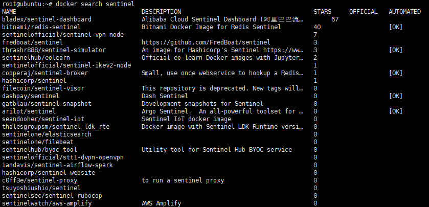
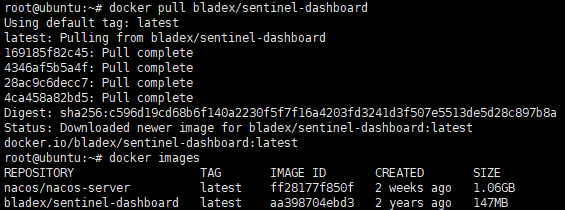
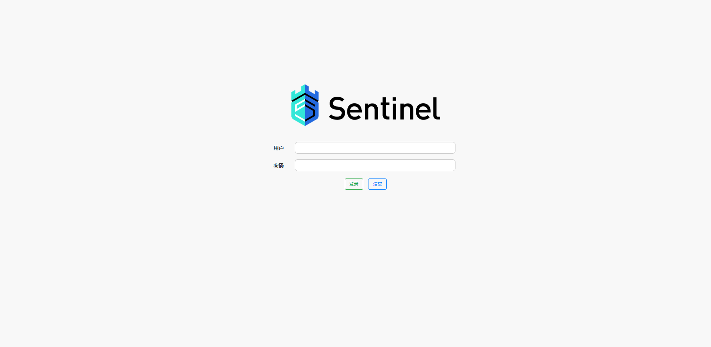
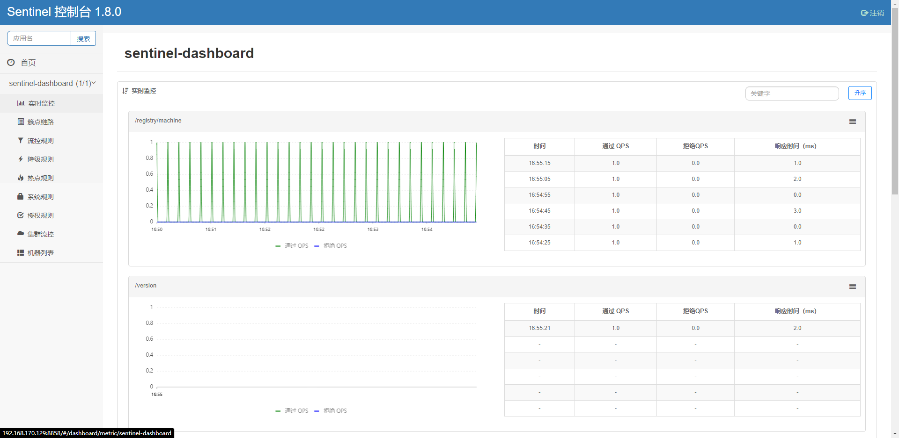

# [Docker：Docker部署Sentinel](https://www.cnblogs.com/nhdlb/p/16858389.html)

## 1. 查看Sentinel版本

```bash
# 查看版本
docker search sentinel
```



## 2. 下载Sentinel镜像

```bash
# 下载镜像的最新版本
docker pull bladex/sentinel-dashboard
```



## 3. 运行Sentinel容器

```bash
# 运行容器 Sentinel默认端口 8858
docker run --name sentinel -p 8858:8858 -td bladex/sentinel-dashboard
```

## 4. 同步系统时间

**Linux的系统时间需要与项目运行环境的时间一致！否则监控不到数据**

**时间同步文章：https://www.cnblogs.com/nhdlb/p/15975987.html**

## 5. 访问Sentinel监控平台

**路径：http://localhost:8858/**

**账户：sentinel**

**密码：sentinel**





[上一](https://www.cnblogs.com/nhdlb/p/16843876.html)