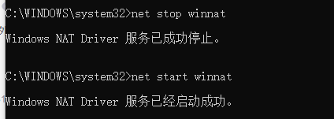

问题描述

今天上班用wind10电脑启动Docker Desktop使用MySQL，突然间报了一个错，错误如下：

```
Error response from daemon: Ports are not available: exposing port TCP 0.0.0.0:3306 -> 0.0.0.0:0: listen tcp 0.0.0.0:3306: bind: An attempt was made to access a socket in a way forbidden by its access permissions.
```

显示Mysql的端口号被占用了？我刚来公司打开电脑，怎么会自动启动MySQL呢。况且我也没有设置docker容器自动启动。然后我又Win+R打开cmd查找了一下mysql的端口号

查看使用3306端口号：

```
netstat -aon|findstr 3306
```

发现并没有服务占用3306这个端口。如果执行以上命令发现3306端口号被占用了，可以点击[查看该文章删除占用端口号](https://www.cnblogs.com/eternality/p/17164166.html)（https://www.cnblogs.com/eternality/p/17164166.html）查询端口改为3306即可。要是端口号没有被其他服务占用，恭喜你和我遇到的是一个错误。

首先通过cmd命令查看哪些端口被禁用TCP协议：

```
netsh interface ipv4 show excludedportrange protocol=tcp
```


发现3006端口没有被禁用。

解决方案：

重新启动NAT网络。首先以管理员身份运行CMD。输入以下命令重新启动：

停止NAT网络：

```
net stop winnat
```

启动NAT网络：

```
net start winnat
```

重新启动成功：



再次启动Mysql容器发现容器启动成功：

