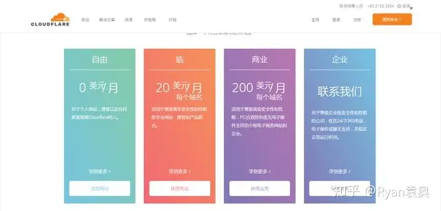
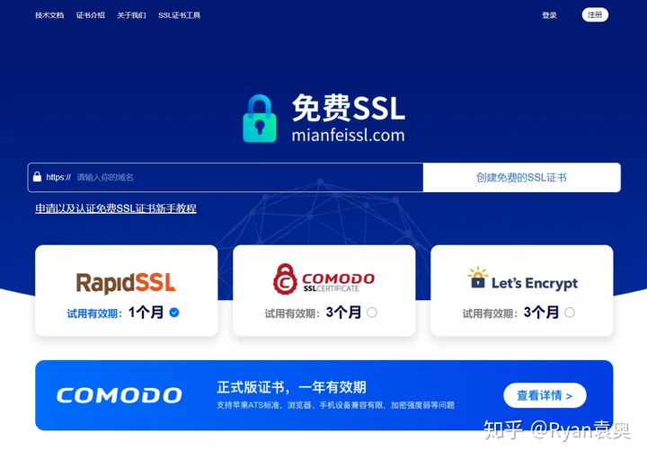

# 33种免费获取SSL证书的方式

[雾中街](https://www.zhihu.com/people/ryanyuan-ao)

94 人赞同了该文章

从2018年7月1日开始，Chrome将显示所有未使用SSL证书的网站标记为“不安全”，而拥有SSL证书的网站的权重排名都会获得提升。

随着企业与网民网络安全意识的增加，全网正在走向全面https的时代，加密将无处不在，无论是网站、APP、软件、小程序等都在大规模应用SSL进行加密。

今天介绍这些在线申请的免费 SSL 证书的网址，希望对大家有所帮助，减少你的成本开支。

**一、阿里云SSL证书服务**

通过阿里云SSL证书服务可以获得由DigiCert提供的免费型DV SSL，为期一年。一个阿云帐户最多签发20张免费证书。支持一键将数字证书部署在阿里云已经开通的云产品中(SLB、Web应用防火墙、DDoS高防IP、CDN)，以最小成本在云上应用，统一管理，方便使用。

阿里云免费SSL证书的领取需要点小技巧，这里详细给大家介绍下：

1. 首先打开这个网址：[https://www.aliyun.com](https://www.aliyun.com/)
2. 在搜索框输入“ssl”，点“搜索”按钮

- 出来搜索结果后，点“立即购买”

- 点“选购证书”，就会出来免费版SSL的选项了

- 点“购买证书”，就会出来选购的的框了

- 点“单域名”，再点“DV SSL”，最后点“免费版”然后购买即可

**二、百度云SSL证书服务**

百度云与全球知名的第三方数字证书认证和服务机构联合推出的SSL证书申请与管理一站式服务。无需繁杂流程，一键申请，轻松实现网站与Web应用的HTTPS加密部署。SSL证书为国内证书服务商TrustAsia（亚洲诚信）联合Symantec为百度云用户专供的证书产品，市场价值1900元。DV证书属于域名验证型证书，支持线上5分钟内快速签发，免费版仅支持单域名，免费期限为1年。

网址链接：https://cloud.baidu.com/product/ssl.html

**三、腾讯云SSL证书服务**

腾讯云SSL证书（SSL Certificates）提供了安全套接层（SSL）证书的一站式服务，包括证书申请、管理及部署功能，与顶级的数字证书授权（CA）机构和代理商合作，为您的网站、移动应用提供 HTTPS 解决方案。通过腾讯云可以获得由Symantec（赛门铁克）提供的免费型DV SSL，为期一年。

网址链接：https://buy.cloud.tencent.com/ssl

**四、华为云SSL证书管理SCM**

华为云.SSL证书管理（SSL Certificate Manager）是华为联合全球知名数字证书服务机构，为您提供一站式证书的全生命周期管理，实现网站的可信身份认证与安全数据传输。通过华为云可以获得由Symantec（赛门铁克）提供的免费型DV SSL，为期一年。

网址链接：https://www.huaweicloud.com/product/scm.html

**五、站长安全认证证书服务**

站长工具证书服务是和全球知名的CA证书服务中心或代理商共同为用户提供的SSL证书服务产品，用户可以通过站长工具，选择需要的CA中心和其证书产品，为用户提供全站Https安全解决方案。由Symantec（赛门铁克）提供的基础级 DV SSL 证书，提供域名型免费版（DV）为期一年。

网址链接：http://aq.chinaz.com/SSL

**六、CloudflareSSL证书服务**

Cloudflare为小型个人网站、博客提供免费的SSL证书服务，只支持扩展支持Server Name Indication(SNI)协议的现代浏览器，这意味着它不支持IE6及之前版本、运行Android 2.2或更旧版本的Android浏览器。

网址链接：https://www.cloudflare.com/ssl

**七、滴滴云SSL证书服务**

滴滴云与全球顶级的CA机构合作，为用户提供安全有保障的SSL证书，使用户轻松实现网站与Web应用的HTTPS加密部署，使网站等Web应用可信，防劫持、防篡改、防监听。由Symantec（赛门铁克）提供的基础级 DV SSL 证书，提供域名型免费版（DV）为期一年。

网址链接：https://www.didiyun.com/production/cert.html

**八、青云SSL证书服务**

青云.SSL证书服务，灵活的DNS和HTTP验证方式 VeriSign G5根证书，完美兼容所有浏览器 主域名可同时支持www和非www 免费重新颁发完善的技术支持服务，由Symantec（赛门铁克）提供的基础级 DV SSL 证书，提供域名型免费版（DV）为期一年。

网址链接：https://www.qingcloud.com/pricing#/SSLCertificate

**九、COMODO PositiveSSL**

OMODO官网只有免费90天的SSL证书试用申请，这个COMODO PositiveSSL证书来自UK2公司，[http://VPS.net](http://vps.net/)等就是UK2公司旗下的产品。目前获取UK2提供的免费COMODO PositiveSSL不需要额外的操作，只需要你将域名的IP地址解析到指定的IP即可。

网址：https://www.sslchaoshi.com/ssl/brand/5

**十、百度云加速免费SSL**

百度云加速与Symantec等合作推出了免费的SSL证书，其实类似于上面的腾讯云DV SSL 证书，

只能使用百度云服务器才可以申请免费SSL证书。

链接：https://console.bce.baidu.com/cas（不支持导出，只可用于百度云产品）

**十一、[http://FreeSSL.org](http://freessl.org/)**

[http://FreeSSL.org](http://freessl.org/)是一个免费提供 HTTPS 证书申请、HTTPS 证书管理和 HTTPS 证书到期提醒服务的网站，旨在推进 HTTPS 证书的普及与应用，简化证书申请的流程。

网址：[https://freessl.org](https://freessl.org/)

**十二、certbot**

- 推荐指数：★★★☆☆
- 免费证书类型：DV 域名型
- 免费证书品牌：Let’s Encrypt
- 免费通配符证书：支持
- 易操作性：困难
- 证书有效期： 90天
- 自动更新：支持
- 自动部署： 支持

再说下这个certbot：certbot是一个脚本类型的Let’s Encrypt证书申请客户端，需要一定的命令行使用经验方可操作，如需自动更新，还需要添加插件，使用起来比较困难。如有自动更新和自动部署需求，建议使用下面介绍的acme.sh和ohttps。

网址：[https://certbot.eff.org](https://certbot.eff.org/)

**十三、acme.sh**

- 推荐指数：★★★★★
- 免费证书类型：DV 域名型
- 免费证书品牌：Let’s Encrypt
- 免费通配符证书：支持
- 易操作性：一般
- 证书有效期： 90天
- 自动更新：支持
- 自动部署： 支持

acme.sh是一个知名的用于申请Let’s Encrypt证书的开源项目，也是属于脚本类型，有比较详细的文档，支持自动化更新和自动化部署。唯一缺点，如果有更新后自动部署至多个节点的需求的话，acme.sh无法满足。如果你有一定的命令行使用经验，acme.sh使用起来还是非常方便，强烈推荐！关于更新后自动部署至多个节点的需求，建议使用下面介绍的ohttps。

网址：[https://acme.sh](https://acme.sh/)

**十四、OHTTPS**

- 推荐指数：★★★★★
- 免费证书类型：DV 域名型
- 免费证书品牌：Let’s Encrypt
- 免费通配符证书：支持
- 易操作性：简单
- 证书有效期： 90天
- 自动更新：支持
- 自动部署： 支持

[http://ohttps.com](http://ohttps.com/)提供了类似于acme.sh的功能，不过提供了友好的管理界面，可申请Let’s Encrypt免费通配符类型证书，还提供了证书吊销、到期前提醒、自动更新、自动部署功能。另外比acme.sh增加了一些非常实用的功能，主要包括可自动部署至阿里云、腾讯云、七牛云的负载均衡、内容分发CDN、SSL证书列表等，并可自动部署至多个nginx容器中。如果你有在证书更新后自动部署至多个不同节点的需求，使用[http://ohttps.com](http://ohttps.com/)就对了，在这里强烈推荐大家使用[http://ohttps.com](http://ohttps.com/)申请和管理Let’s Encrypt颁发的免费HTTPS证书。

网址：[https://ohttps.com](https://ohttps.com/)

**十五、便宜SSL**

便宜SSL是一家国内的SSL证书提供商，同样也拥有免费证书。而且提供丰富的工具。

网址：[https://www.pianyissl.com](https://www.pianyissl.com/)

**十六、免费SSL**

免费SSL证书是一个完全免费的SSL证书申请平台，证书保证100% 永久免费，供大家测试和使用。

网址：[https://www.mianfeissl.com](https://www.mianfeissl.com/)

**十七、SSL For Free**

证书是免费的，但是时间是三个月，比较短，不过到期可以续订。

网址：[https://www.sslforfree.com](https://www.sslforfree.com/)

**十八、SSL For Free**

使用SSL Site Seal提供90天的免费SSL证书具有与更高安全性验证SSL证书相同的加密强度和浏览器接受率。

网址：https://secure.ssl.com/certificates/free

**十九、GoGetSSL**

每隔90天通过简单的续订过程即可获取SSL证书。它是来自受信任的证书颁发机构的最高强度的证书。可以使用自动化API自动续订，重新验证和安装已颁发的证书。每个免费的SSL都带有一个绿色的地址栏锁，可在所有浏览器的移动设备上使用。可以根据需要使用它，每90天进行一次快速续订。

网址：https://www.gogetssl.com/sslcerts/free-ssl

**二十、InstantSSL**

与所有流行的浏览器兼容，**即时SSL** **试用** **证书**易于安装，并提供最高质量的技术支持。试用SSL证书是学习SSL证书的理想选择，可让您在系统上线之前为其确定最佳证书。

网址：https://www.instantssl.com/products/ssl-trial-ssl-certificate-tls

**二十一、瑞安自签名ssl证书**

一款简约的SSL证书自签工具，可随时随地签发SSL证书。

网址：[https://ssl.ryanyuanao.xyz](https://ssl.ryanyuanao.xyz/)

**二十二、来此加密**

**Let’s Encrypt** 网页版本，获取SSL网站证书。

网址：[https://letsencrypt.osfipin.com](https://letsencrypt.osfipin.com/)

**二十三、ZeroSSL**

ZeroSSL是一款免费的网站SSL证书申请网站，用户无需下载或安装任何插件，一切操作都在浏览器进行，只要进入ZeroSSL然后填入相关信息，照着凭证产生密钥的步骤做即可获取。

网址：[https://zerossl.com](https://zerossl.com/)

**二十四、Let’s Encrypt**

Let’s Encrypt —— 是一个由非营利性组织 互联网安全研究小组（ISRG）提供的免费、自动化和开放的证书颁发机构（CA），简单的说，就是为网站提供免费的 SSL/TLS 证书。

网址：https://letsencrypt.org/zh-cn

**二十五、奇安信安全卫士**

如果要使用SSL证书必须得实名认证，而且还得使用他们家的CDN。

网址：[https://wangzhan.qianxin.com](https://wangzhan.qianxin.com/)

**二十六、又拍云SSL 证书服务**

又拍云 SSL 证书服务（SSL Certificates Service），提供 SSL 证书的申购、管理、部署等功能。与国际顶级 CA 机构合作，证书类型丰富，操作流程简单方便，为用户提供一站式 HTTPS 安全解决方案。

链接：https://www.upyun.com/products/ssl

**二十七、七牛云免费SSL证书**

七牛云 SSL 证书提供证书申请、管理等一站式服务，与顶级的数字证书授权（CA）机构和代理商合作，为您的网站、应用、服务保驾护航。

链接：https://www.qiniu.com/products/ssl

**二十八、Hostinger Free SSL Certificate**

通过每个业务计划获得的免费SSL证书，确保您的网站安全，赢得客户的信任

链接：https://www.hostinger.com/free-ssl-certificate

**二十九、[http://FreeSSL.cn](http://freessl.cn/)**

[http://FreeSSL.cn](http://freessl.cn/)是一个提供免费HTTPS证书申请的网站。

链接：[https://freessl.cn](https://freessl.cn/)

**三十、trustico免费ssl证书**

具备功能齐全的30天免费试用SSL证书，可在几分钟内保护在线交易和应用程序安全，从而在Web浏览器和移动设备上实现高达256位的加密。在您下订单的几分钟之内，您的网站即可获得安全保护并可以进行电子商务交易。

链接：https://www.trustico.com.hk/dv/comodo/trial/free-comodo-trial-certificate.php

**三十一、免费SSL证书**

SSL证书可以保护您的信息并将其更改为难以渗透的代码，从而可以防止网络黑客和入侵者的攻击，将为您的访客提供站点盖章，挂锁，浏览器地址栏中的https等等的保证。

通过SSL证书进行的验证可以向您的网站访问者证明他们在合法网站上，并且可以安全，无缝地进行交易。

链接：[https://www.freesslcertificate.org](https://www.freesslcertificate.org/)

**三十二、免费获得HTTPS！**

您现在可以从非营利性证书颁发机构Let’s Encrypt获得免费的https证书（包括通配符证书） 。这是一个网站，它将带您逐步执行手动步骤，以获取免费的https证书，以便您可以使自己的网站使用https！该网站是 开源的 ，**从不**要求您提供私钥。永远不要相信要求您提供私钥的网站！

链接：[https://gethttpsforfree.com](https://gethttpsforfree.com/)

**三十三、他妈的主机免费SSL证书**

SSL证书用作数字“护照”，允许通过安全网络传输数据-保护金融和信用卡交易，注册，对邮件的Web访问，敏感信息和Intranet。它对通过网站传输到服务器的数据进行身份验证和加密。

链接：https://www.tmdhosting.com/ssl-certificates.html

截止2020-8-16，以上免费ssl证书申请方式均有效！

其他还有NakedSSL（[http://www.nakedssl.com](http://www.nakedssl.com/)）通过根域名流量全部重新导向的最简单解决方案，提供3种不同的计划，涵盖免费版。

购买以下主机商的主机免费提供ssl证书：

- [蓝色主机](https://cn.bluehost.com/)
- [站点场地](https://www.siteground.com/)
- [鳄鱼主机](https://www.hostgator.com/)
- [博客引擎](https://wpengine.com/)
- [梦幻主机](https://www.dreamhost.com/)
- [乐行主机](https://www.inmotionhosting.com/)
- [绿极客](https://www.greengeeks.com/)
- [爱网页](https://www.ipage.com/)
- [明亮网站](https://www.liquidweb.com/)

如果您已经在使用这些主机之一，则可以从主机仪表板打开免费的SSL证书。只需登录到主机帐户的cPanel仪表板，然后向下滚动到“安全性”部分。

[蓝色主机](https://cn.bluehost.com/)用户可以通过访问“我的网站”»“管理网站”页面找到免费的SSL选项。从这里，您可以切换到“安全性”选项卡并为您的网站打开免费的SSL证书。

根据您主机的不同，您的虚拟主机控制面板可能与上面的截图有所不同。如果无法找到免费的SSL选项，则可以要求主机商为您启用它。

**便宜SSL证书的**有很多家：

SSL超市：[https://www.sslchaoshi.com](https://www.sslchaoshi.com/)

便宜SSL：[https://www.pianyissl.com](https://www.pianyissl.com/)

cheapssl：[Cheap SSL Certificates. Buy or Renew Cheapest SSL at $4.80](https://cheapsslsecurity.com/)

Gogetssl：https://www.gogetssl.com/domain-validation/comodo-positive-ssl/

Starfieldtech：https://www.starfieldtech.com/

------

[33种免费获取SSL证书的方式www.ryany.cn/106.html](https://www.ryany.cn/106.html)